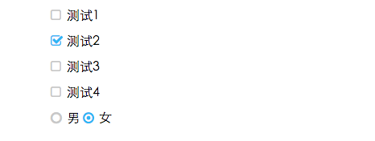

### [type="checkbox"]和[type="radio"]通过`CSS`重写默认／选择样式

#### 使用
```html
<link rel="stylesheet" href="font-awesome.css">

<!-- 全部重写 -->
<link rel="stylesheet" href="checkbox-radio.reset.css">

<!-- 部分重写 -->
<link rel="stylesheet" href="rcheckbox-rradio.reset.css">
```

##### 重写页面所有checkbox/radio

```html
<input type="checkbox">
<input type="radio">
```

##### 重写页面部分checkbox/radio

```html
<input type="checkbox" class="rcheckbox">
<input type="radio" class="rradio">
```

#### 效果
